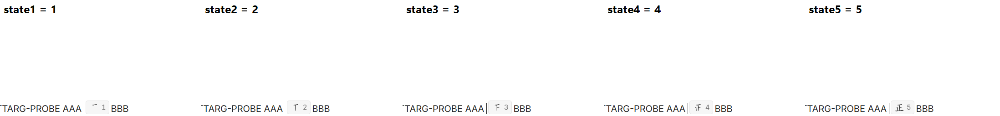
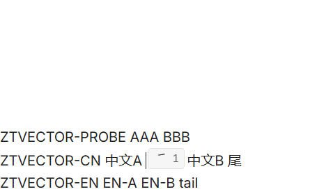
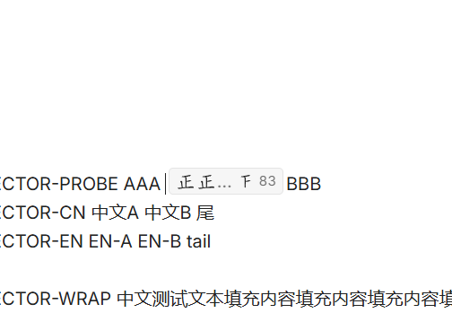
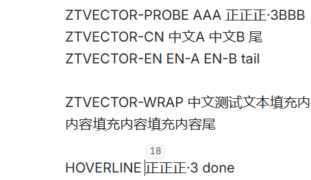
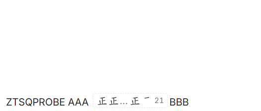
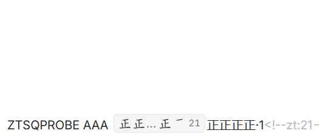

# Zheng Tally for Obsidian

Chinese 正-character tally counting in the Obsidian Markdown editor (desktop).

Press `Alt+Z`, tap `Space` to count, `Enter` to commit. The tally stays a
live canonical `正` vector in your note — never degrading into plain text —
and can be resumed later with a click or `Alt+Z`.

## Features

- True CodeMirror 6 inline widget — the counter sits inside the text flow
- Canonical 5-stroke `正` vector preview, progressive 1 → 5
- Font-aware sizing and baseline via a hidden native `正` measurement
- Persistent resumable tally objects (`正正正·3<!--zt:18-->`) with restart recovery
- Stable readable Markdown (visible text never depends on the plugin)
- Large-count compact preview that never drops the in-progress group
- Hover/caret count badge for legacy tallies (conservative detection)
- Fail-closed sessions: `Esc` writes nothing, exceptions leave no residue

## Screenshots

All screenshots below are captured from real Obsidian smoke runs.

Progressive strokes 1–5 (same canonical vector, per-state path counts):



Inline counting between Chinese text (size/baseline match the surroundings):



Large-count compact preview with exact total on the right:



Committed-tally hover badge (no layout shift, no document edit):



Persisted tally chip after `Enter` (same vectors, quieter chrome):



Resumed tally back in counting mode (click the chip, or caret + `Alt+Z`):



## Installation

### From release (recommended)

1. Download `main.js` and `manifest.json` from
   [Releases](https://github.com/yunmin311/zheng-tally-obsidian/releases)
2. Place them in `<vault>/.obsidian/plugins/zheng-tally/`
3. Enable the plugin in Settings → Community plugins

### From source

```bash
git clone https://github.com/yunmin311/zheng-tally-obsidian.git
cd zheng-tally-obsidian
npm install
npm run build
```

Copy `dist/main.js` and `dist/manifest.json` to your vault's plugin folder.
No `styles.css` is needed (the plugin ships none).

## Usage

1. Open a Markdown note in Obsidian desktop
2. Press `Alt+Z` (`Start Zheng Tally counting`) to enter tally mode
3. Press `Space` (or `+`) to count up, `Backspace` (or `-`) to count down
4. Press `Enter` to commit — the tally stays a persistent vector chip
5. Click the chip (or caret + `Alt+Z`) to resume counting from its total
6. Press `Esc` to cancel without writing anything

Only one tally session is active at a time. Switching leaves ends the session
without writing.

## Keyboard controls

| Key | Action |
|-----|--------|
| `Alt+Z` | Start tally session |
| `Space` / `+` / `NumpadAdd` / `Shift+=` | +1 |
| `Backspace` / `-` / `_` / `NumpadSubtract` | −1 (floors at 0) |
| `Enter` | Commit stable Markdown, single edit |
| `Esc` | Cancel, zero document changes |

`Ctrl`/`Alt`/`Meta` combinations pass through and keep the session alive.

## Stable Markdown format

`Enter` writes readable plain text plus a plugin ownership marker carrying the
integer source of truth:

| Count | Stored text |
|-------|-------------|
| 0 | *(nothing — `Esc` instead; resuming to 0 deletes the tally)* |
| 1 | `·1<!--zt:1-->` |
| 4 | `·4<!--zt:4-->` |
| 5 | `正<!--zt:5-->` |
| 7 | `正·2<!--zt:7-->` |
| 18 | `正正正·3<!--zt:18-->` |

General rule: `floor(count/5)` copies of `正`, plus `·N` for a non-zero
remainder, plus `<!--zt:count-->`. The visible text never depends on the
plugin — with the plugin disabled, readers still see `正正正·3`. A marker is
only honored when its count re-serializes to exactly the preceding visible
text; mismatches fail closed (no widget, no rewrite).
An optional Unicode tally-marks format (`commitFormat: "unicode"`) exists in
settings, but font coverage for U+1D372–U+1D376 is unreliable, so it stays opt-in.

## Persistent resumable tally

After `Enter`, the tally keeps rendering as a persistent vector chip — same
canonical strokes, same box metrics, quieter chrome. It survives note
reopens, plugin reloads, and Obsidian restarts (it re-derives from the
Markdown every time; nothing is stored outside the note).

- **Resume**: click the chip, or place the caret on/adjacent to it and press
  `Alt+Z`. Counting restarts from the stored total (never from zero); the
  chip temporarily becomes the active tally widget.
- **Resume + `Enter`**: single edit rewrites text + marker
  (18 → 23 gives `正正正正·3<!--zt:23-->`), then the persistent chip returns.
- **Resume + `Esc`**: zero document changes, original chip restored.
- **Resume to 0 + `Enter`**: deletes the whole stable text + marker.
- **Ambiguity fails closed**: a caret touching two adjacent marked tallies
  resumes neither; clicking a chip always names its own token.
- **Persisted total**: hidden by default (space reserved, so no layout shift),
  revealed on hover or when the caret/selection reaches the chip.
- **Legacy upgrade**: an unmarked `正正正·3` under a conservative boundary can
  be resumed with caret + `Alt+Z` and upgrades to marked form on next `Enter`.
  A lone bare `正` never auto-resumes — only `正<!--zt:5-->` is reliable.

## Large-count compact preview

Up to 4 group slots render fully so every `+1` visibly adds a stroke. Beyond
that the preview compacts but always keeps the most-recent completed group
and the current partial slot:

```text
18 -> 正 正 正 [state3] 18
20 -> 正 正 正 正 20
21 -> 正 正 … 正 [state1] 21
83 -> 正 正 … 正 [state3] 83
```

The right-hand total (`zt-total`, `0.75em`, dimmed, tabular numerals) is always
the exact live count. Active and persisted chips share the same grouping
algorithm, so `Enter` never visually jumps.

## Hover/caret count badge

Moving the mouse over, or placing the caret inside, a legacy unmarked tally
token shows its numeric count (e.g. `正正正·3` → `18`). Marked tallies render
their own persistent chip instead, so the badge never duplicates them. The
badge is a transient anchored overlay: it is hidden by default, never edits
the Markdown, adds no metadata, and never shifts surrounding text.

Detection is deliberately conservative (heuristic): a token only counts at a
hard boundary (document start/end, whitespace, punctuation, symbols). Matches
inside ordinary Han/Latin/digit runs never badge — `正正好`, `正正方方`,
`测试正正内容` and `第·3项` stay silent. A lone `正` (count 5) is never badged
either, since it is indistinguishable from ordinary Chinese prose. This is an
explicit design limitation, not something heuristics should override.

## Canonical 5-stroke vector architecture

The preview is built from one vendored 5-stroke vector source for `正`
(Hanzi Writer Data, derived from Make Me a Hanzi / Arphic fonts — see
[License](#license)). Canonical stroke order 横 / 竖 / 横 / 竖 / 横 is preserved;
state *N* renders exactly the first *N* paths. No rasterization, no canvas
masks, no per-font stroke guessing, no network requests at runtime.

## Typography / native sizing

Each tally glyph pairs two layers in the same grid cell:

- a hidden native `正` span — the **only** sizing element, providing the real
  advance width, line box and baseline from the current editor font
  (family/size/weight/style/color are inherited);
- the canonical SVG stroke overlay, which fills that cell with its own
  intrinsic sizing suppressed (`contain: size`, zero minimums), so the
  default 300×150 SVG box can never decide the layout.

Strokes use `fill="currentColor"`, so light/dark themes recolor for free.

## Limitations

- **Obsidian desktop only** — no mobile support
- **Single counter** — one active tally session at a time
- **No history or statistics** — each session is independent
- **Conservative badge** — lone `正` and in-word matches never badge (by design)
- **Conservative ownership** — lone `正` without a marker never auto-resumes
- Switching leaves cancels the session without writing

## Development

```bash
npm install       # install dependencies
npm run dev       # watch mode build
npm run build     # production build (dist/main.js + dist/manifest.json)
npm test          # run tests (138 passing)
npm run lint      # eslint
npm run typecheck # tsc --noEmit
```

## Architecture

- `src/zheng-strokes.ts` — canonical 5-stroke vectors for `正` (Arphic data, not MIT)
- `src/renderer.ts` — native-sized vector glyph + tally chip DOM
- `src/cm6-widget.ts` — true CM6 inline `Decoration.widget`
- `src/editor-host.ts` — single sanctioned CodeMirror access point
- `src/editor-session.ts` — keyboard capture, lifecycle, commit/cancel
- `src/tally-hover.ts` — legacy-token parser + transient count badge
- `src/persistent-tally.ts` — marked-token replace decorations, resume lookup
- `src/tally-state.ts` — pure integer state, stable/marked serialization
- `src/settings.ts` — commit format preference
- `src/main.ts` — plugin entry, command registration
- `vendor/` — Arphic Public License + attribution notes

## License

- **Plugin source code: MIT** — see [LICENSE](LICENSE).
- **Canonical `正` stroke vector data: Arphic Public License, NOT MIT** —
  source Hanzi Writer Data / Make Me a Hanzi, extracted from Arphic Technology
  fonts. Full data license: [vendor/ARPHICPL.txt](vendor/ARPHICPL.txt),
  attribution notes: [vendor/README.md](vendor/README.md).
